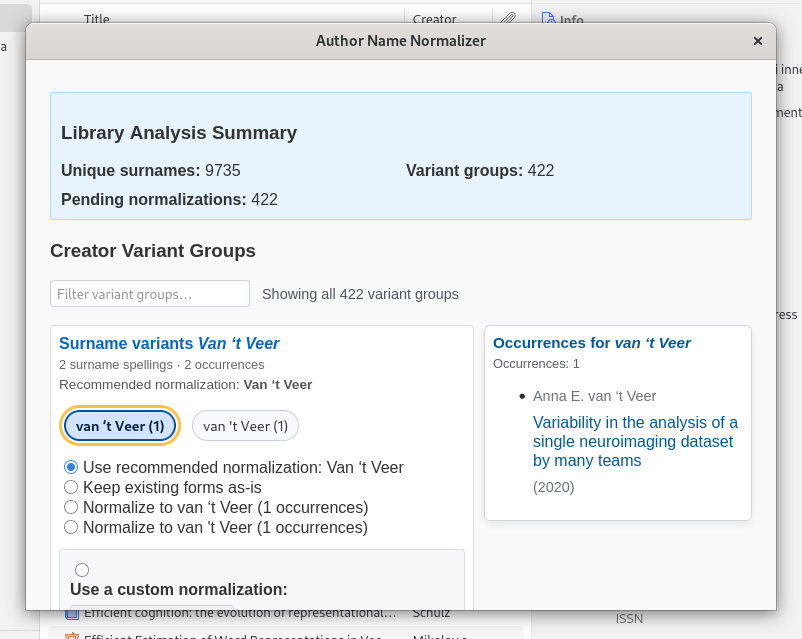

# Zotero Name Normalizer

Normalize author name variants in your Zotero library (diacritics, initials,
spelling and ordering) so bibliographies, searches and author counts are
consistent and reliable.

Short description
-----------------

Zotero Name Normalizer scans a Zotero library, groups creator name variants
into candidate normalization suggestions, and provides an interactive dialog
to review, edit, and apply normalizations safely. Intended for researchers,
librarians and anyone who maintains large Zotero collections.

Status
------

Fully functional and tested on Zotero 7/8. Analysis is non-destructive — you
must explicitly apply normalizations for changes to be written to your
library. Always keep a recent library backup before running bulk operations.

Why use this
------------

- Fix diacritics vs ASCII mismatches (e.g. "Miłkowski" vs "Milkowski")
- Unify initials, abbreviations and full given names ("J. A. Fodor" → "Jerry A. Fodor")
- Correct misplaced prefixes and compound surnames
- Reduce duplicate author entries and improve citation consistency

Key features
------------

- Full-library analysis to detect surname and given-name variants
- Interactive review dialog with item previews and variant frequency info
- Normalization of surnames is sensitive to prefixes and compound surnames (such as "van" or "de la")
- Per-group and bulk apply/decline operations via Zotero API
- Learning engine to remember user choices for future suggestions
- Exportable JSON reports for offline inspection and debugging

For developer setup and build/test instructions, see [docs/DEVELOPMENT.md](docs/DEVELOPMENT.md).

Usage
-----

1. Open Zotero and install the extension (development mode or packaged XPI)
2. Run a full-library analysis from the Name Normalizer menu
3. Review suggested variant groups in the dialog and apply per-group or
	 bulk normalizations
4. Optionally export analysis results as JSON for offline review

Notes & troubleshooting
-----------------------

- Analysis is non-destructive. Normalizations are applied only when you
	explicitly confirm them in the dialog.
- On modern Zotero builds the extension writes exported JSON to the Zotero
	data directory by default (no filepicker). Check the Error Console
	(Tools → Developer → Error Console) for details when exporting.
- If you encounter errors, include console logs and a short description of
	your Zotero version and the action you performed when reporting an issue.

Contributing
------------

Contributions welcome. See [docs/DEVELOPMENT.md](docs/DEVELOPMENT.md) for
developer setup and architecture notes. Please open issues for bugs and
feature requests; pull requests should include tests when applicable.

License
-------

GPL-3.0 © 2026 Marcin Miłkowski
