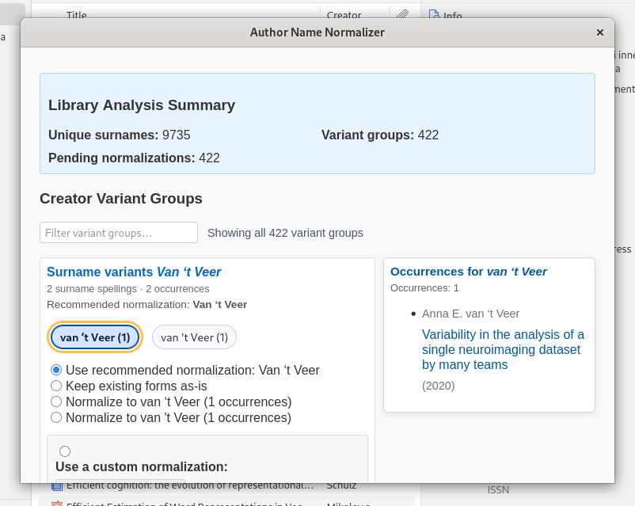

# Zotero Name Normalizer

Normalize author name variants in your Zotero library (diacritics, initials,
spelling and ordering) so bibliographies, searches and author counts are
consistent and reliable.

Short description
-----------------

Zotero Name Normalizer scans a Zotero library, groups creator name variants
into candidate normalization suggestions, and provides an interactive dialog
to review, edit, and apply normalizations safely. Intended for researchers,
librarians and anyone who maintains large Zotero collections.

Status
------

Fully functional and tested on Zotero 7/8. Analysis is non-destructive — you
must explicitly apply normalizations for changes to be written to your
library. Always keep a recent library backup before running bulk operations.

Localization
------------

This extension supports WebExtension-style localization through `_locales/`.
A Polish locale is included in `_locales/pl/messages.json`, and the extension
name, description, menu labels, and dialog titles are translatable.

Why use this
------------

- Fix diacritics vs ASCII mismatches (e.g. "Miłkowski" vs "Milkowski")
- Unify initials, abbreviations and full given names ("J. A. Fodor" → "Jerry A. Fodor")
- Correct misplaced prefixes and compound surnames
- Reduce duplicate author entries and improve citation consistency

Key features
------------

- Full-library analysis to detect surname and given-name variants
- Interactive review dialog with item previews and variant frequency info
- Normalization of surnames is sensitive to prefixes and compound surnames (such as "van" or "de la")
- Per-group and bulk apply/decline operations via Zotero API
- Learning engine to remember user choices for future suggestions
- Exportable JSON reports for offline inspection and debugging

Field Normalization
-------------------

Zotero Name Normalizer can also normalize publication metadata fields so that
variant spellings of the same value are unified across your library.

A single **Tools ▸ Normalize Field…** entry opens the field-normalization
dialog. Pick the field to normalize from the dropdown at the top — it lists the
text fields present on the items in scope (sorted by how many items use them),
so you can normalize **any** field, including Series, Language, Rights, Format,
Edition, and the "Original" publisher/place fields, not just the three built-in
ones.

The right matching heuristics are applied automatically based on the field you
choose:

- **Publisher** — case differences ("Oxford University Press" vs "Oxford
  university press"), suffix variations ("… Press" vs "… Press USA"), ampersand
  vs "and" ("Taylor & Francis" vs "Taylor and Francis"), and multi-publisher
  values ("Oxford University Press; Clarendon Press") split and processed
  separately.
- **Location/Place** — case and punctuation ("Cambridge, MA" vs "Cambridge
  MA"), US state abbreviations ("Cambridge, MA" ↔ "Cambridge, Mass." ↔
  "Cambridge, Massachusetts"), and country suffixes ("New York, NY" vs "New
  York, NY, USA"). Does NOT merge different cities (e.g. "New York" stays
  separate from "Oxford, New York").
- **Journal** — strict matching to avoid merging different journals: case,
  "The" prefix ("The Journal of Philosophy" ↔ "Journal of Philosophy"), and
  ampersand vs "and". Does NOT merge "Journal of Neuroscience" with "Journal of
  Cognitive Neuroscience".
- **Any other field** — a generic heuristic: case/punctuation normalization, token overlap, and a fuzzy threshold. These fields are treated as a single value (not split on `;`/`/`), so values like rights statements are left intact.

### Similarity threshold

A **Similarity threshold** slider controls how aggressively close spellings are
grouped: 0 catches only exact matches (after case/punctuation normalization),
while higher values also catch spelling variants (e.g. "Behavioural" vs
"Behavioral"). Changing the slider re-groups the values immediately.

### Excluded fields

Identifier, date, and numeric fields are intentionally left out of the dropdown because fuzzy-grouping them makes no sense — including DOI, ISBN, ISSN, PMID, PMCID, call number, URL, dates, page/volume/issue numbers, and bulky text such as titles and abstracts.

### How It Works

1. Select items, a collection, or a library, then choose
   **Tools ▸ Normalize Field…**
2. Pick the field to normalize from the dropdown (adjust the similarity
   threshold if needed)
3. Review the suggested groups — each shows the variants and item counts
4. Edit the normalized value if needed, or apply the suggested normalization
5. Confirm to apply changes to your library

Usage
-----

1. Open Zotero and install the extension (development mode or packaged XPI)
2. **Select the library or collection** you want to analyze in Zotero's library tree:
   - Click on "My Library" to analyze your personal library
   - Click on a group library to analyze that shared library
   - Click on a specific collection to analyze only items in that collection
3. Run a full-library analysis from the Name Normalizer menu
4. Review suggested variant groups in the dialog and apply per-group or
   bulk normalizations
5. Optionally export analysis results as JSON for offline review

### Library Scope

The Name Normalizer automatically operates on the **currently selected library or collection** in Zotero's UI, following the same pattern as other Zotero plugins like zotero-search-replace:

- **Collection selected**: Normalizes only items within that collection
- **Library selected** (My Library or a group library): Normalizes all items in that library
- **Items selected**: Normalizes items from the library containing the selected items
- **Nothing selected**: Defaults to your personal library (My Library)

This means you can:
- Normalize author names in your personal library
- Normalize author names in any group library you're a member of
- Normalize author names in a specific collection without affecting other collections

### Field Normalization

Metadata fields (publisher, place, journal, and any other text field such as
Series, Language, Rights, or Format) are normalized via **Tools ▸ Normalize
Field…** and the field dropdown — see the [Field Normalization](#field-normalization)
section above for details. The selected library/collection determines the scope,
just like author analysis.

Notes & troubleshooting
-----------------------

- Analysis is non-destructive. Normalizations are applied only when you
	explicitly confirm them in the dialog.
- On modern Zotero builds the extension writes exported JSON to the Zotero
	data directory by default (no filepicker). Check the Error Console
	(Tools → Developer → Error Console) for details when exporting.
- If you encounter errors, include console logs and a short description of
	your Zotero version and the action you performed when reporting an issue.

Contributing
------------

Contributions welcome. See [docs/DEVELOPMENT.md](docs/DEVELOPMENT.md) for
developer setup and architecture notes. Please open issues for bugs and
feature requests; pull requests should include tests when applicable.

License
-------

GPL-3.0 © 2026 Marcin Miłkowski
